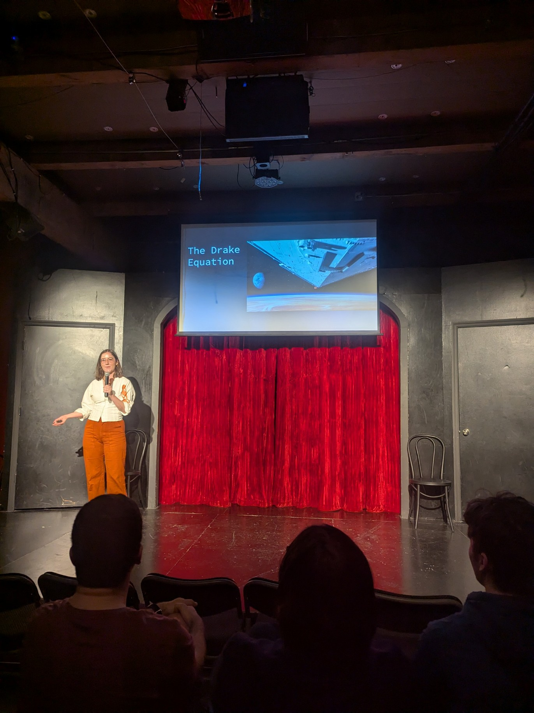
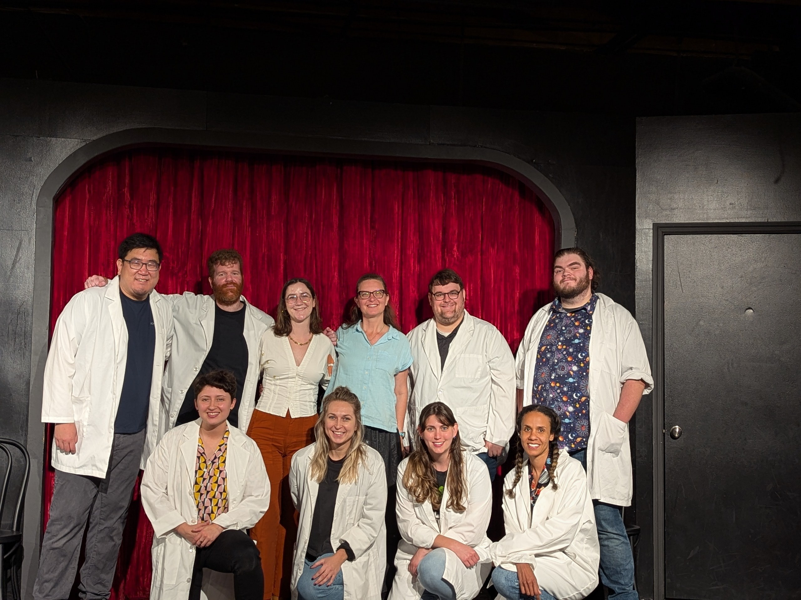

## Research

So far, my work has focused on preparing to succesfully coordinate electromagnetic and gravitational wave observations from merging massive black holes detected by LISA. I'm especially interested in utilizing my past experince at observatories and work with photometry to help characterize the unique challenges that arise when using real astronomical data. 

## Papers

<b>Carolyn L. Drake</b>, J. Runnoe, et. al., "Preliminary Census of LISA-type Error Volumes using SDSS Photo-
metery", accepted, MNRAS, expected Fall 2025

W. Yu, <b>Carolyn L. Drake</b>, et. al., 2025, "Contaminating Electromagnetic Transients in LISA Gravitational-wave 
Localization Volumes. I. The Intrinsic Rates", ApJ, 981, 141

Daniel A. Dale, <b>Carolyn L. Drake</b>, et. al., 2020, "Radial Star Formation Histories in 32 Nearby
Galaxies", AJ, 159, 5

Feel free to refer to my [ORCiD](https://orcid.org/0009-0006-1022-5627) for more details and links to publications.

## Outreach

I love sharing the knowledge and education I've had the privlege to gain over the years with as many people as possible. As someone who's interest in Astronomy began through public outreach (the movie Interstellar and a fateful NPR segment), I personally know the importance of outreach events and how transformative they can be for anyone. In the past, I've been involved with the Star Parties events run through Texas A&M University, volunteered at Meet the Astronomer Nights through Dyer Observatory, and even helped to found a Women in STEM club at my undergraduate institution. 

Recently, I was able to combine my love of improv with my love of science and present at an Improv Science Theater show at Third Coast Comedy Club, seen below!

  
   

