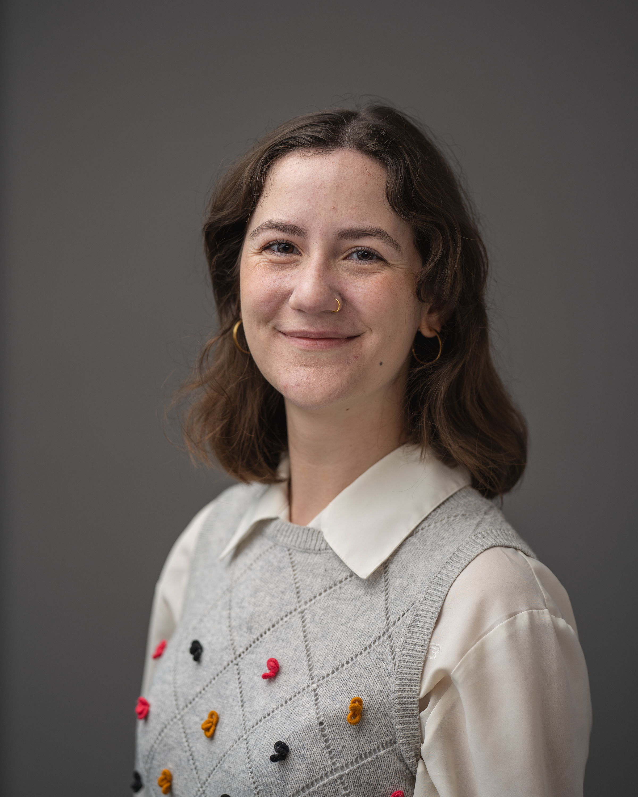
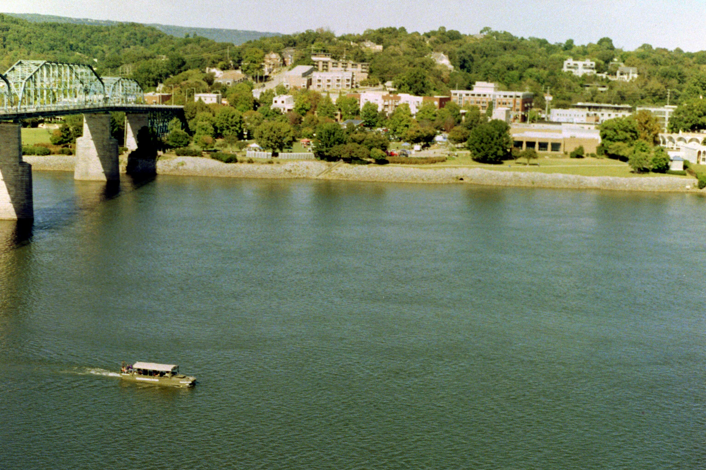
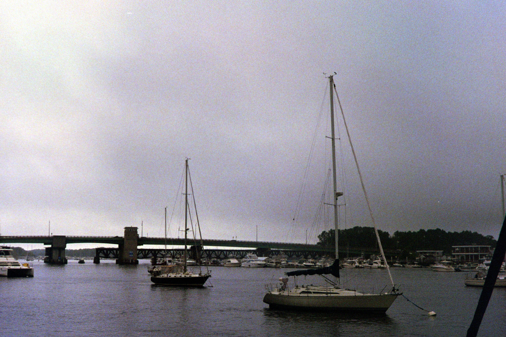

# About

Hi! My name is Carolyn Drake and I am currently a second year graduate student in the Astronomy and Physics department at Vanderbilt University working under Jessie Runnoe. Originally from outside Houston, I went to Whitman College in Washington for my undergraduate degree. I set up this little website as a quick and easy way to get to know about me and what I do. There is also contact info at the bottom if you need to reach me about a specific question not covered here. Thanks for stopping by!

## Research

Working towards coordinating electromagnetic (EM) follow up for future LISA detections by preforming prelimanry censuses of LISA type error volumes using current large area astronomical surveys.

## Hobbies

Outside of work, my main hobbies include baking, movies (some of my favorites being: [When Harry Met Sally](https://www.imdb.com/title/tt0098635/), [Rear Window](https://www.imdb.com/title/tt0047396/?ref_=fn_al_tt_1), [Clue](https://www.imdb.com/title/tt0088930/?ref_=fn_al_tt_1), and [After Yang](https://www.imdb.com/title/tt8633464/?ref_=fn_al_tt_1)).

  
   
  

  
   
  

### Contact

Feel free to reach out using carolyn.drake@vanderbilt.edu with any and all questions about the work that I do!
